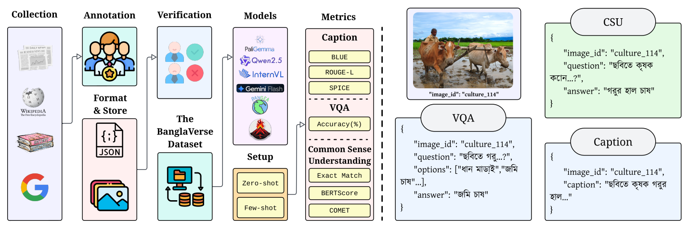

# BanglaVerse: A Benchmark Dataset for Visual Understanding of Multilingual Vision-Language Models in Bangla with Cultural Awareness

_**Abstract**_: Vision-language research has advanced rapidly, yet culturally grounded multimodal datasets for Bangla remain limited. We introduce BanglaVerse, a manually annotated, image-centric benchmark covering nine culturally rich domains and supporting three different tasks. Through cross-verified annotation, we emphasize grounding in images, cultural awareness, and commonsense nuance. We evaluate state-of-the-art multilingual vision-language models under zero-shot, few-shot, and chain-of-thought prompting, revealing domain-specific strengths and limitations. Notably, Gemini-2.5-Flash achieves the most robust results, while few-shot prompting provides the strongest overall gains, especially in complex domains. 

<p align="center">
  
</p>

## 📂 Dataset Structure

```
BanglaVerse/
├── culture/
│   ├── images/
│   │   ├── culture_001.png
│   │   ├── culture_002.png
│   │   └── ...
│   └── annotations/
│       ├── culture_captions.json
│       ├── culture_qa_pairs.json
│       └── culture_commonsense_reasoning.json
├── history/
├── politics/
├── national_achievements/
├── sports/
├── media_and_movies/
├── personalities/
└── food/
└── nature/
```

## 📦 Dataset Components

### 1. Captions Generation

Task: Short descriptions of each image in **Bangla**.

```json
{
  "image_id": "food_002",
  "caption": "একটি প্লেটে পরিবেশন করা গরম গরম ইলিশ মাছের সাথে পান্তা ভাত।"
}
```

### 2. Visual Question Answering (VQA)

Task: Answer direct visual questions about an image based on multiple choices.

```json
{
  "image_id": "sports_005",
  "question_bn": "ছবিতে কোন খেলাটি চলছে?",
  "options_bn": ["ক্রিকেট", "ফুটবল", "হ্যান্ডবল", "কাবাডি"],
  "answer_bn": "কাবাডি"
}
```

### 3. Commonsense Understanding Tasks

Task: Answer contextual and culturally relevant questions about the image using prior knowledge.

```json
{
  "image_id": "media_002",
  "question": "ছবির এই টেলিভিশন নাটকটি কোন জনপ্রিয় লেখকের রচনায় নির্মিত?",
  "answer": "হুমায়ূন আহমেদ"
}
```
