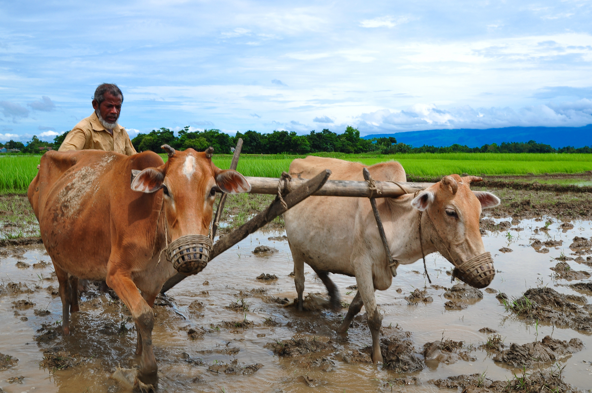

# _Many Dialects, Many Languages, One Cultural Lens_: Evaluating Multilingual VLMs for Bengali Culture Understanding Across Historically Linked Languages and Regional Dialects

_**Abstract**_: Bangla culture is richly expressed through region, dialect, history, food, politics, media, and everyday visual life, yet it remains underrepresented in multimodal evaluation. To address this gap, we introduce BanglaVerse, a culturally grounded benchmark for evaluating multilingual vision–language models (VLMs) on Bengali culture across historically linked languages and regional dialects. Built from 1,152 manually curated images across nine domains, the benchmark supports visual question answering and captioning, and is expanded into four languages and five Bangla dialects, yielding ∼32.3K artifacts. Our experiments show that evaluating only standard Bangla overestimates true model capability: performance drops under dialectal variation, especially for caption generation, while historically linked languages such as Hindi and Urdu retain some cultural meaning but remain weaker for structured reasoning. Across domains, the main bottleneck is missing cultural knowledge rather than visual grounding alone, with knowledge-intensive categories. These findings position BanglaVerse as a more realistic test bed for measuring culturally grounded multimodal understanding under linguistic variation.

<p align="center">
  
</p>

Fig: Overview of the BanglaVerse dataset and experimental setup. The figure shows the two task types, example annotations for each task, artifacts generation and evaluation pipeline with multiple metrics.

## 📂 Dataset Structure

```
BanglaVerse/
├── culture/
│   ├── images/
│   │   ├── culture_001.png
│   │   ├── culture_002.png
│   │   └── ...
│   └── annotations/
│       ├── culture_captions.json
│       ├── culture_qa_pairs.json
│       └── culture_commonsense_reasoning.json
├── history/
├── politics/
├── national_achievements/
├── sports/
├── media_and_movies/
├── personalities/
└── food/
└── nature/
```

## 📦 Dataset Components

<div align="center">
  
</div>

| Dialect/Language | Caption | VQA |
| :--- | :--- | :--- |
| [cite_start]**English** [cite: 1] | [cite_start]The farmer in the picture is plowing the land with an ox-drawn plow, a tradition of rural agriculture. [cite: 1] | [cite_start]**Question:** What work is being done using the cow in the picture?<br>**Options:** A) Paddy threshing B) Land cultivation C) Grain reserve D) Cattle feed preparation<br>**Answer:** Land cultivation [cite: 1] |
| [cite_start]**Bangla** [cite: 1] | [cite_start]ছবিতে কৃষক গরুর হাল দিয়ে জমি চাষ করছেন, যা গ্রামীণ কৃষির ঐতিহ্য। [cite: 1] | [cite_start]**Question:** ছবিতে গরু ব্যবহার করে কী কাজ করা হচ্ছে?<br>**Options:** A) ধান মাড়াই B) জমি চাষ C) শস্য মজুদ D) গো-খাদ্য প্রস্তুত<br>**Answer:** জমি চাষ [cite: 1] |
| [cite_start]**Hindi** [cite: 1] | [cite_start]चित्र में किसान बैल हल से ज़मीन जोत रहे हैं, जो ग्रामीण कृषि की परंपरा है। [cite: 1] | [cite_start]**Question:** चित्र में बैल का उपयोग करके कौन सा कार्य किया जा रहा है?<br>**Options:** A) धान की मड़ाई B) खेत जोतना C) अनाज भंडारण D) गो-आहार तैयार करना<br>**Answer:** खेत जोतना [cite: 1] |
| [cite_start]**Urdu** [cite: 1] | [cite_start]تصویر میں کسان بیلوں سے بل چلا کر زمین تیار کر رہا ہے، جو دیہی زراعت کا ایک روایتی طریقہ ہے۔ [cite: 1] | [cite_start]**Question:** تصویر میں گائے کا کیا استعمال ہو رہا ہے؟<br>**Options:** A) دھان کی گہائی B) کاشت زمین C) غلہ کا ذخیرہ D) گھاس کی تیاری<br>**Answer:** کاشت زمین [cite: 1] |
| [cite_start]**Barishal** [cite: 1] | [cite_start]ছবিডায় এউক্কা কিষান গরুর হাল দিয়া ভুঁই চষতে আছে, যেইডা গেরামের কৃষির পুরান নিয়ম। [cite: 1] | [cite_start]**Question:** ছবিডায় গরু দিয়া কী কাম করা অইতেছে?<br>**Options:** A) ধান মাড়াই B) ভুঁই চষা C) শস্য থোওয়া D) গরুর খাওন বানানো<br>**Answer:** B) ভুঁই চষা [cite: 1] |
| [cite_start]**Chittagong** [cite: 1] | [cite_start]ছবিত একুয়া কিষান গরুর হাল দিয়েনে জইম চষের, যিয়ান গাঁয়র কৃষির পুরানা নিয়ম। [cite: 1] | [cite_start]**Question:** ছবিত গরু দিয়েনে কী কাম গরের?<br>**Options:** A) ধান মাড়াই B) জইম চষা C) শস্য তহন D) গরুর হানা বানান<br>**Answer:** B) জইম চষা [cite: 1] |
| [cite_start]**Noakhali** [cite: 1] | [cite_start]ছবিডাত একজন কিষান গরুর হাল দি জমি চাষ করের, হেইডা গেরামের কৃষির পুরানা নিয়ম। [cite: 1] | [cite_start]**Question:** ছবিডাত গরু দি কী কাম করা হন্নের?<br>**Options:** A) ধান মাড়াই B) জমি চাষ C) শস্য রাহন D) গরুর খানা বানান<br>**Answer:** B) জমি চাষ [cite: 1] |
| [cite_start]**Rangpur** [cite: 1] | [cite_start]ছবিত একনা কিষান গরুর হাল দিয়া জমিত হাল বাওবার নাগছে, যেইটা গাওয়ের কৃষির পুরানা নিয়ম। [cite: 1] | [cite_start]**Question:** ছবিত গরু দিয়া কী কাম করা হাইবার নাগছে?<br>**Options:** A) ধান মাড়াই B) জমিত হাল বাওয়া C) শস্য থোওয়া D) গরুর খাবার বানান<br>**Answer:** B) জমিত হাল বাওয়া [cite: 1] |
| [cite_start]**Sylhet** [cite: 1] | [cite_start]ছবিত একজন কিষান গরুর হাল দিয়া খেত চাষ কররা, যেতা গাওর কৃষির পুরানা নিয়ম। [cite: 1] | [cite_start]**Question:** ছবিত গরু দিয়া কিতা কাম করা অর?<br>**Options:** A) ধান মাড়াই B) খেত চাষ C) শস্য তওয়া D) গরুর খানি বানান<br>**Answer:** B) খেত চাষ [cite: 1] |
