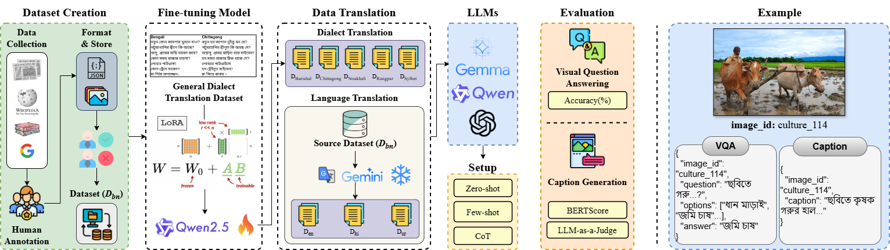

# _Many Dialects, Many Languages, One Cultural Lens_: Evaluating Multilingual VLMs for Bengali Culture Understanding Across Historically Linked Languages and Regional Dialects

_**Abstract**_: Bangla culture is richly expressed through region, dialect, history, food, politics, media, and everyday visual life, yet it remains underrepresented in multimodal evaluation. To address this gap, we introduce BanglaVerse, a culturally grounded benchmark for evaluating multilingual vision–language models (VLMs) on Bengali culture across historically linked languages and regional dialects. Built from 1,152 manually curated images across nine domains, the benchmark supports visual question answering and captioning, and is expanded into four languages and five Bangla dialects, yielding ∼32.3K artifacts. Our experiments show that evaluating only standard Bangla overestimates true model capability: performance drops under dialectal variation, especially for caption generation, while historically linked languages such as Hindi and Urdu retain some cultural meaning but remain weaker for structured reasoning. Across domains, the main bottleneck is missing cultural knowledge rather than visual grounding alone, with knowledge-intensive categories. These findings position BanglaVerse as a more realistic test bed for measuring culturally grounded multimodal understanding under linguistic variation.

<p align="center">
  
</p>

## 📂 Dataset Structure

```
BanglaVerse/
├── culture/
│   ├── images/
│   │   ├── culture_001.png
│   │   ├── culture_002.png
│   │   └── ...
│   └── annotations/
│       ├── culture_captions.json
│       ├── culture_qa_pairs.json
│       └── culture_commonsense_reasoning.json
├── history/
├── politics/
├── national_achievements/
├── sports/
├── media_and_movies/
├── personalities/
└── food/
└── nature/
```

## 📦 Dataset Components

### 1. Captions Generation

Task: Short descriptions of each image in **Bangla**.

```json
{
  "image_id": "food_002",
  "caption": "একটি প্লেটে পরিবেশন করা গরম গরম ইলিশ মাছের সাথে পান্তা ভাত।"
}
```

### 2. Visual Question Answering (VQA)

Task: Answer direct visual questions about an image based on multiple choices.

```json
{
  "image_id": "sports_005",
  "question_bn": "ছবিতে কোন খেলাটি চলছে?",
  "options_bn": ["ক্রিকেট", "ফুটবল", "হ্যান্ডবল", "কাবাডি"],
  "answer_bn": "কাবাডি"
}
```

### 3. Commonsense Understanding Tasks

Task: Answer contextual and culturally relevant questions about the image using prior knowledge.

```json
{
  "image_id": "media_002",
  "question": "ছবির এই টেলিভিশন নাটকটি কোন জনপ্রিয় লেখকের রচনায় নির্মিত?",
  "answer": "হুমায়ূন আহমেদ"
}
```
